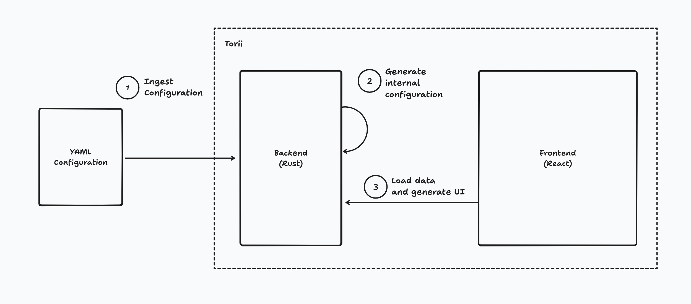

# Design

## How Torii works

Torii works with 2 main components:

- Backend: The backend is a Rust application that exposes a REST API to interact with the frontend. It's configured with a YAML file that
  contains the catalog of tools and services available to developers.
- Frontend: The frontend is a React application that interacts with the backend to display the catalog of tools and services available to
  developers.

Once the backend is started, it loads the configuration file, checks the syntax, and starts the REST API. Then, the frontend can be started
and it will interact with the backend to display the catalog of tools and services available to developers.

When a developer wants to use a tool or service, the frontend sends a request to the backend to get the form to fill. The backend sends the
form to the frontend, the developer fills it, and sends it back to the backend. The backend runs the validation scripts, the post-validation
scripts, and updates the model with the values returned by the post-validation scripts.

As a Platform Engineer, you can easily define a catalog of tools and services available to developers.
